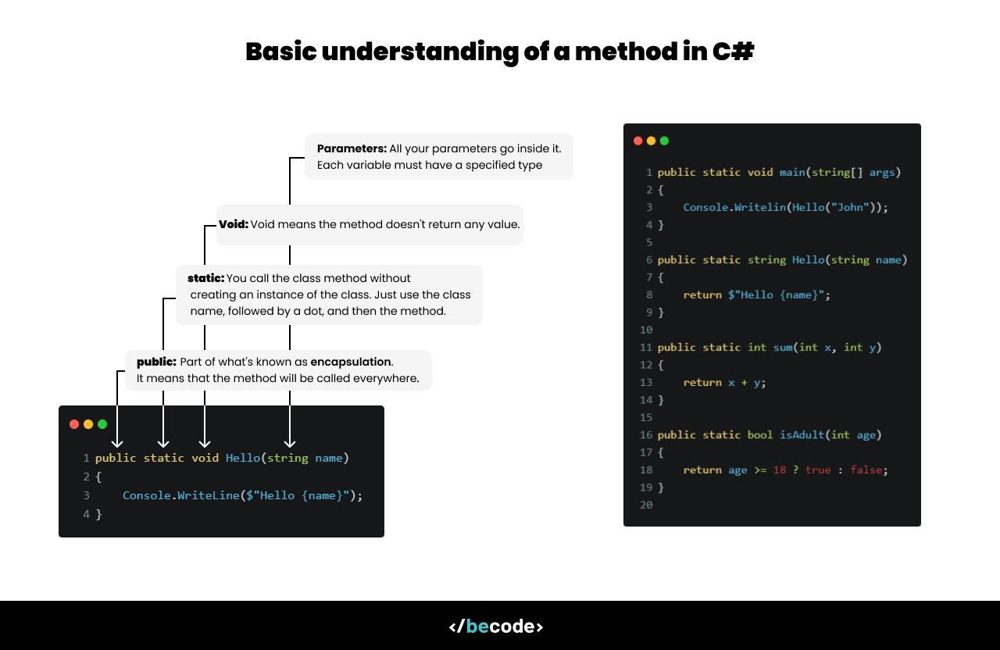

[](https://classroom.github.com/a/AZaGM95C)
# 10. Functions (methods) 

## Introduction

In this lesson, we are going to learn how to create your own functions in C#, even if you have already seen or created them before. There are some very important points to understand.




As the image shows, you need to place them in a specific order, but not all elements are mandatory.

- Modifiers (e.g., public, private)
- Static or non-static indicator (static or none)
- Return type (e.g., void, int)
- Method name

## 1. `Modifiers` 

|Modifier|Accessible within the class|Accessible in derived classes|Accessible within the same assembly|Accessible outside the assembly|
|--------|---------------------------|-----------------------------|-----------------------------------|-------------------------------|
|public|Yes|Yes|Yes|Yes|
|private|Yes|No|No|No|
|protected|Yes|Yes|No|No|
|internal|Yes|No|Yes|No|

- When to use each modifier?
    - `public`: Use it when you want to make a member accessible everywhere.
    - `private`: Use it to hide implementation details and protect internal data.
    - `protected`: Useful when you want to allow derived classes to access certain members while keeping them hidden from other parts of the code.
    - `internal`: Useful to restrict access to members within a project, while making them available across that project.

## 2. `static` or not `static`

When you start a new project (if you unchecked the "low-level details" option...), you will see this in your solution.

```csharp
namespace Hello
{
    internal class Program
    {
        static void Main(string[] args)
        {
          //...
        }
    }
}
```

Let's break this down:

- Each solution has its own namespace, which helps avoid name conflicts. For example, you can have two classes with the same name in different namespaces. This allows for better organization and prevents naming collisions across different projects or libraries.

- The `internal` keyword specifies that the class is only accessible within the same project (assembly). If you remove it, the class remains internal by default. If you need to access it from another project, you'll need to make it `public` or use `[InternalsVisibleTo]`.


```csharp
Console.WriteLine();
```

- `Console`: is a class.
- `WriteLine()`: is a method from the `Console` class.

We call the method using a dot (`.`) because `WriteLine` is a static method, which means it belongs to the class itself and not to an instance of the class.

If you don't want to use static, you can do something like this:

```csharp
Random rand = new Random();
int n = rand.Next(1,10) 
```

In this example, the `Next` method is not static, but we still call it using a dot. The difference is that we first create an instance of the `Random` class with `new Random()`. This is because `Next` is an instance method, meaning it can only be called on an instance of the class.

### When to use or avoid `static` ?

In C#, the decision to use the static keyword depends on how you intend to use your methods or variables.

1. When to use `static`?
    - Use `static` when you need to call a method or access a variable without creating an instance of the class.
    - `static` members belong to the class itself rather than to an instance of the class. This means that they are shared across all instances, and you can access them directly from the class name.

    ```csharp
    internal class MathHelper
    {
        public static int Add(int x, int y)
        {
            return x + y;
        }
    }

    int result = MathHelper.Add(2,5);
    ```

2. When to avoid `static`?
    - Avoid using `static` when the method or variable needs to work with instance-specific data. If your method relies on data specific to each object, it should not be static.
    - Non-static methods can access instance variables (fields) and can be overridden if the class is inherited, providing more flexibility.

    ```csharp
    internal class Person
    {
        public string Name { get; set; }

        public static string Introduce()
        {
            return $"Hello { Name }";
        }
    }

    Person person = new Person();
    person.Name = "Pierre";
    Console.WriteLine(person.Introduce());
    ```

## 3. Return a type (or more) 

A method must return a type, or if there is nothing to return, you can use the keyword `void`.

So, take this example:

```csharp
namespace Project
{
    internal class Game
    {
        public static int GenerateNumber(int x, int y)
        {
            Random rand = new Random();
            return rand.Next(x,y);
        }

        public static void Start()
        {
            int n = GenerateNumber(1,10);
            Console.WriteLine($"The game starts with a random number {n}");
        }
    }
}

// So we can call the method like this:
Console.WriteLine(Game.Start()); 
```

### Tuple

Image now that I want to return for example more than one number generated? Well, tuple could answer your problem.

```csharp
public static (int,int) GenerateNumber(int x, int y)
{
    Random rand = new Random();
    return (rand.Next(x,y), rand.Next(x,y));
}

public static void Start()
{
    (int x, int y) = GenerateNumber(1,10);
    Console.WriteLine($"The game starts with two random numbers {x} and {y}");
}
// So we can call the method like this:
Console.WriteLine(Game.Start()); 
```

### Out parameters

Another way to return multiple values is by using the `out` parameter. Let's take a look. But be careful, note that this method returns `void`.

```csharp
namespace Project
{
    internal class Math
    {
        public static void MinAndMax(out int min, out int max, params int[] numbers)
        {
            min = int.MinValue;
            max = int.MaxValue;

            foreach(number in numbers){
                if(number > max) max = number;
                if(number < min) min = number; 
            }
        }
    }
}

// So we call it in the main method
Math.MinAndMax(out int min, out int max, 1, 5, 3, 29, 2, 9);
Console.WriteLine($"Min : {min} and Max : {max}");
```

## Exercices

### 1. Sum or not?
Create a method that takes two integers as parameters and returns their sum.

```csharp
[Test]
public void Test_Sum()
{
    Assert.That(Methods.Solution.Sum(2,5), Is.EqualTo(7));
}
```

### 2. Who's ?
Create a method that takes three parameters: first name, last name, and age. The method should return a string that combines this information in a sentence.

```csharp
[Test]
public void Test_Whos()
{
    Assert.That(Methods.Solution.Whos("John","Doe",23), Is.EqualTo("Firstname : John\nLastname : Doe\nAge : 23"));
}
```

### 3. Sum and product

Create a method that calculates both the sum and the product of two numbers. Use out parameters to return multiple values.

```csharp
[Test]
public void SumAndProduct_ShouldReturnCorrectSumAndProduct()
{
    int sum, product;
    Methods.Solution.SumAndProduct(3, 4, out sum, out product);

    Assert.AreEqual(7, sum, "The sum of 3 and 4 should be 7.");
    Assert.AreEqual(12, product, "The product of 3 and 4 should be 12.");
}
```

### 4. Sum and product again

Create a method that returns two values in the form of a tuple: the quotient and the remainder of an integer division.

```csharp
[Test]
public void QuotientAndRemainder_ShouldReturnCorrectQuotientAndRemainder()
{
    var result = Methods.Solution.QuotientAndRemainder(10, 3);

    Assert.AreEqual(3, result.quotient, "The quotient of 10 divided by 3 should be 3.");
    Assert.AreEqual(1, result.remainder, "The remainder of 10 divided by 3 should be 1.");
}
```

### 5. Method with a Default Value

Create a method that takes a parameter with a default value. If the user does not provide a value, the method will use the default value.

```csharp
[Test]
public void MethodWithDefaultValue_ShouldReturnDoubleOfProvidedValue()
{
    int result = Methods.Solution.MethodWithDefaultValue(5);
    Assert.AreEqual(10, result, "The result with a value of 5 should be 10.");
}

[Test]
public void MethodWithDefaultValue_ShouldReturnDoubleOfDefaultValue_WhenNoValueIsProvided()
{
    int result = Methods.Solution.MethodWithDefaultValue();
    Assert.AreEqual(20, result, "The result with no provided value should be 20 (10 by default multiplied by 2).");
}
```

--- 

