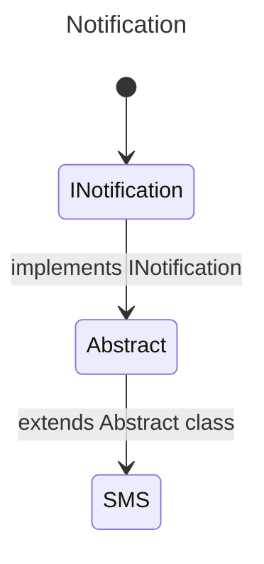

[](https://classroom.github.com/a/cegnRsl5)
# 13. Polymorphism & Dependency Injection

Before we delve deeper into the two concepts mentioned above, it is necessary to set the groundwork. We will cover in a few points what interfaces, abstract classes (including abstract methods) are, before concluding with an explanation of what polymorphism is and finishing with dependency injection.

## 1. Interfaces
Imagine you are working on a project that implements a notification system. Today, your system can notify a client via email.

So you begin your feature. Implementing a class? That's a good thing. Here is a small implementation of the feature.

```csharp
public class Email 
{
    public void SendEmail(string message) 
    {
        // Implementing the feature
    }
}
```

Imagine, our classe have multiple methods, because here, for example, this class is very simple. Suppose your project manager asks you to implement a new notification method via SMS. How would you implement it? Its methods?

You would then open the *Email* class, observe what you have already developed, and try to reproduce what is already existing while adapting it to this new feature.

This is where "interfaces" and abstract classes come into play. Let's focus on interfaces for the moment.

>In object-oriented programming, an interface is a set of public method signatures of an object.

It's somewhat a contract that classes must adhere to if it is implemented. It may contain:
-cProperties
-cMethods (public)

```csharp
public interface INotification
{
    public void Send();
}

public class Email: INotification
{
    public void Send()
    {
        // 
    }
}

public class SMS : INotification
{
    public void Send()
    {
        // 
    }
}
```

Please note that interfaces in .NET, for convention's sake, must start with a capital `I`. Which sort of allows implementing the methods or properties of the interface in the class.

If these methods are not implemented in the class, you will get an error during the build.

You see, it's simple, right?

## 2. Abstract Classes
Well now, let me introduce you to several important scenarios.

1. Shared methods are identical, should I "rewrite" this same method in every class that implements this interface?
2. I have three classes that share the same interface, two of them have an identical method, however, in the third class, it's completely different, what to do?

The answer is simply abstract classes.

> In object-oriented programming (OOP), an abstract class is a class if and only if it is not instantiable. It serves as a base for other derived (inherited) classes.

From there, we can understand that it is a class that:
- is not instantiable,
- serves as a base for other classes.

This perfectly addresses our issue.



```csharp
public interface INotification
{
    void Send(string message);
}

public abstract class Notification : INotification
{
    public abstract void Send(string message);

    public void Acknowledge()
    {
        // Common code to acknowledge receipt
    }
}

public class Email : Notification
{
    public override void Send(string message)
    {
        // Send an email with the message
    }
}

public class SMS : Notification
{
    public override void Send(string message)
    {
        // Send an SMS with the message
    }
}
```

- `public abstract void Send()`: Abstract methods must be defined in an `abstract` class without containing an implementation body. They must be mandatorily implemented in the derived classes, each providing their own implementation. 
- `public void Acknowledge()`: A non-abstract and non-virtual method provides base code that can be used as is in derived classes. It cannot be overridden, but it can be hidden in a derived class using the new keyword if a different behavior is needed.
- `public override void Send()`:The override keyword is used in a derived class to provide a custom implementation of a method declared as `virtual`, `abstract`, or already override in a base class. It replaces the base implementation when the method is called on the derived type.
- `public virtual void Send()`: A virtual method provides a default implementation in the base class. It can be optionally overridden in derived classes using the override keyword to modify or extend its behavior.

### Calling the Base Constructor
When inheriting from a class, sometimes the derived class needs to call the constructor of the base class to ensure proper initialization. This is where the base keyword comes into play.

- The `base` keyword allows you to call the constructor of the base class from a derived class.

Let's modify our Notification example:

```csharp
public abstract class Notification : INotification
{
    protected string _sender;

    public Notification(string sender)
    {
        _sender = sender;
    }

    public abstract void Send(string message);
}

public class Email : Notification
{
    private string _emailAddress;

    public Email(string sender, string emailAddress) : base(sender) // Calls base class constructor
    {
        _emailAddress = emailAddress;
    }

    public override void Send(string message)
    {
        Console.WriteLine($"Sending email from {_sender} to {_emailAddress}: {message}");
    }
}
```


## Polymorphism 
> In computer science and type theory, polymorphism, from the ancient Greek polús (many) and morphê (form), is the concept of providing a single interface to entities that can have different types.

```csharp

public interface IForm
{
    float Aire(); // If the method is public, not mandatory to write it.
}

public abstract class Form : IForm
{
    public abstract float Aire();
}

public class Square : Form
{
    public float side { get; set; }

    public override float Aire()
    {
        return (float) Math.Pow(side, 2);
    }
}

public class Circle : Form
{
    public float radius {get; set;}

    public override float Aire()
    {
        return (float) (Math.PI * Math.Pow(radius, 2));
    }
}
```

Now let's try to understand how we instantiate our two classes.

Usually, we proceed this way:

```csharp
Square square = new {side = 12.3f};
Circle circle = new {radius = 23.2f};
```

But with polymorphism, the interface can become the type.

```csharp
Form square = new Square {side = 12.3f};
Form circle = new Circle {radius = 23.2f};  
```

You might ask: OK, but what use is that to me? I understand your frustration, that's why we need to move on to the section on "dependency injection".

[See more about Polymorphism](https://learn.microsoft.com/en-us/dotnet/csharp/fundamentals/object-oriented/polymorphism)

## Dependency Injection

> Dependency injection facilitates the management of dependencies between components by delegating them to an external manager (often called a "dependency injection container"), which handles the creation and binding of necessary dependencies without the components having to manage these details themselves.

Dependency injection is an important concept in object-oriented programming.

This concept allows for the division of classes into services and for associating them without making them dependent on one another.

Consider a case where an user can receive notifications about a bill. It is preferable to proceed as follows:

- An User service
- A Notification service

And to create a dependency injection in the user class.

The reason for doing this is that, suppose your project manager asks you when a product is available on your e-commerce site, it should also be possible to send notifications to users.

We then have a service that is called in two different places. This notification service does not depend on any specific class. It is simply implemented in a class that requires this service.

This allows work on the notification service independently of the classes calling this service.

### Example
Now let's move on to an example, which I hope will help you understand.

### 1. Define an Interface
First, we define an interface that specifies the methods the dependent implementation must provide. For example, an IService interface that has an Execute method.

```csharp
public interface IService
{
    void Execute();
}
```

### 2. Create an Implementation of the Interface
Next, we create a concrete class that implements this interface. This class will perform the specific functionality.

```csharp
public class MyService : IService
{
    public void Execute()
    {
        Console.WriteLine("Service is executed.");
    }
}
```

### 3. Use Dependency Injection in a Consumer Class
Now, we create a class that consumes IService. This class does not create an instance of MyService directly but receives an instance through its constructor. This is called "dependency injection."

```csharp
public class Consumer
{
    private IService _service;

    public Consumer(IService service)
    {
        _service = service;
    }

    public void RunService()
    {
        _service.Execute();
    }
}
```

## Exercices
### 1. Abstract Classes and Polymorphism

- Define an Abstract Class:
    - Create an abstract class called `Vehicle`.
    - Add an abstract method named **Start()** in the `Vehicle` class. This method will be implemented by subclasses to define specific behavior when the vehicle starts.

- Create Subclasses:
    - Define a subclass `Car` that inherits from Vehicle.
        - Implement the **Start()** method to display a message specific to starting a car (e.g., "The car starts with a roar.").
    - Define another subclass `Motorcycle` that also inherits from Vehicle.
        - Implement the **Start()** method to display a message specific to starting a motorcycle (e.g., "The motorcycle starts with a loud rev.").

- Test Polymorphism:
    - Create a list of `Vehicle` objects, where each object is an instance of either `Car` or `Motorcycle`.
    - Loop through the list and call the **Start()** method on each object.
    - Ensure that the correct implementation of **Start()** is called for each object, depending on whether it is a `Car` or a `Motorcycle`.

- Expected Outcome:
    - When iterating through the list and calling **Start()** on each object, you should see the specific message for each type of vehicle printed, demonstrating polymorphism in action.

### 2. Interface and Polymorphism
- Define an Interface:
    - Create an interface named `Animal`.
    - Add a method **MakeNoise()** in the `Animal` interface. This method will represent a common behavior for all animals, allowing them to produce a sound.

- Implement the Interface in Classes:
    - Create a class `Dog` that implements the `Animal` interface.
        - Define the **MakeNoise()** method to display the sound specific to a dog, such as "Barks".
    - Create another class `Cat` that implements the `Animal` interface.
        - Define the **MakeNoise()** method to display the sound specific to a cat, such as "Meows".

- Test Polymorphism:
    - Create a list of `Animal` objects, where each object is an instance of either `Dog` or `Cat`.
    - Iterate through the list and call the **MakeNoise()** method on each object.
    - Polymorphism should ensure that the correct implementation of **MakeNoise()** is executed for each animal, regardless of whether it is a `Dog` or a `Cat`.

- Expected Outcome:
    - When iterating through the list, the program will call the **MakeNoise()** method for each animal and display their respective sounds (e.g., "Barks" for a Dog, "Meows" for a Cat).

### 3. Abstract Class and Interface
- Define an Abstract Class:
    - Create an abstract class named `Shape`.
    - Add an abstract method **CalculateArea()** in the class. This method will be implemented by subclasses to calculate the area of specific shapes.
    - Shape acts as a base class to define common characteristics or behaviors for all shapes.

- Define an Interface:
    - Create an interface named `Paintable`.
    - Add a method **Paint(string color)** to the interface. This method will define the behavior for painting a shape with a specific color.

- Implement Both in Subclasses:
    - Create a class `Circle` that inherits from Shape and implements `Paintable`.
        - Implement the **CalculateArea()** method to compute the area of a circle using the formula: `π * radius^2`.
        - Implement the **Paint(color)** method to display a message indicating that the circle has been painted with the specified color.
    - Create another class Square that also inherits from `Shape` and implements `Paintable`.
        - Implement the **CalculateArea()** method to compute the area of a square using the formula: `side^2`.
        - Implement the **Paint(color)** method to display a message indicating that the square has been painted with the specified color.

- Test the Implementation:
    - Create instances of `Circle` and Square with specific dimensions.
    - Call the **CalculateArea()** method on each shape and display the result.
    - Use the **Paint(color)** method on each shape to simulate painting it with a specific color.

- Expected Outcome:
    - When **CalculateArea()** is called, the program should compute and display the area of the shape based on its dimensions.
    - When **Paint(color)** is called, the program should display a message indicating the shape has been painted with the specified color.

### 4. Dependency Injection
- Create a `Class` Engine:
    - Define a base class `Engine` with a method **Function()**. This method will describe the behavior of the engine (e.g., "Runs on gasoline" or "Runs on diesel").
    - The `Engine` class will act as the base class for different types of engines.

- Create Specific `Engine` Subclasses:
    - Create a subclass `GasolineEngine` that inherits from `Engin`e.
        Override the Function() method to describe a gasoline engine (e.g., "This engine runs on gasoline.").
    - Create another subclass `DieselEngine` that also inherits from Engine.
    - Override the **Function()** method to describe a diesel engine (e.g., "This engine runs on diesel.").

- Create a `Class` Car:
    - Define a class `Car` that requires an Engine object as a parameter in its constructor.
    - Store the `Engine` object as a dependency of the `Car` object.
    - Create a method in Car (e.g., **Start()**) that calls the **Function()** method of the Engine to indicate what type of engine the car is using.

- Use Dependency Injection:
    - When creating a `Car` object, inject a specific type of engine (e.g., GasolineEngine or DieselEngine) via the constructor.
    - This allows flexibility, as the `Car` object does not need to know the specific type of engine at compile time.

- Test the Implementation:
    - Create instances of `GasolineEngine` and `DieselEngine`.
    - Inject each engine type into a `Car` object.
    - Call the **Start()** method on the `Car` object to verify the correct engine behavior is executed.

- Expected Outcome:
   -  When a car with a GasolineEngine starts, it should indicate, "This car runs on gasoline."
    - When a car with a DieselEngine starts, it should indicate, "This car runs on diesel."

---


