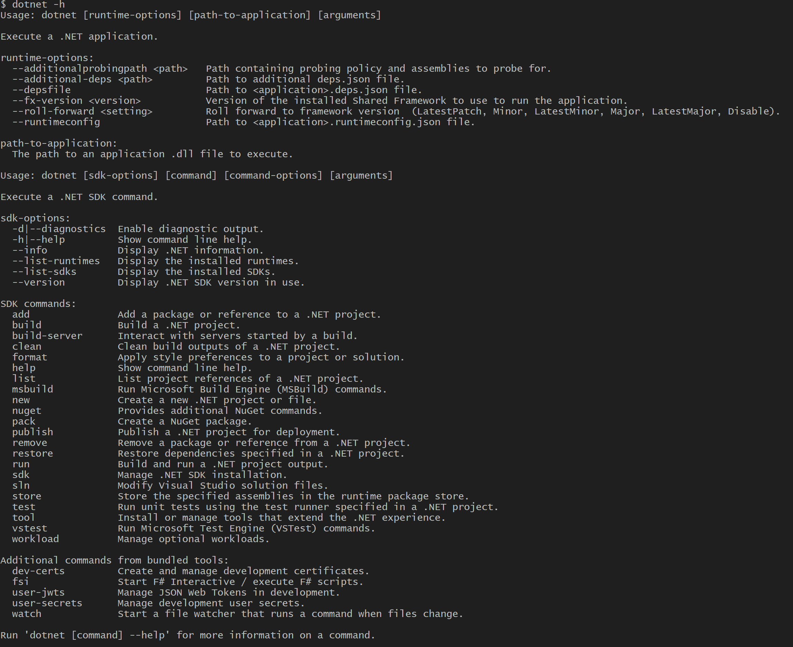

[](https://classroom.github.com/a/6Hp-sOjz)
## 2. Installation & tools

Utilizing .NET Core for development offers a versatile and efficient platform for building various types of applications.

Whether you prefer the lightweight and customizable environment of Visual Studio Code or the comprehensive features of Visual Studio, .NET Core provides seamless integration with both. Additionally, .NET Core supports command-line usage, allowing developers to execute tasks efficiently through the dotnet command-line interface.

## Installation:

Before diving into development with .NET Core, it's essential to install the .NET Core SDK on your system. You can download the SDK from the official .NET website (https://dotnet.microsoft.com/download) and follow the installation instructions provided for your operating system.

### Using Visual Studio:


Visual Studio provides a comprehensive integrated development environment (IDE) with advanced features for .NET Core development. To use Visual Studio for .NET Core development:

- Download and install Visual Studio from the official website (https://visualstudio.microsoft.com/).
- Launch Visual Studio and create a new project by selecting "Create a new project" from the start window or the File menu.
- Choose the appropriate project template for your .NET Core application, such as Console Application, ASP.NET Core Web Application, etc.
- Follow the prompts to configure your project settings and create the project.
- Once your project is created, you can start coding, debugging, and testing your application using the rich features of Visual Studio.

For this fundamentals course, please choose **Console Application**

### Using Visual Studio Code:


Visual Studio Code (VS Code) is a popular choice among developers for its flexibility and extensive extension ecosystem. To begin using .NET Core with VS Code, follow these steps:

- Install Visual Studio Code from the official website (https://code.visualstudio.com/).
- Install the C# extension for Visual Studio Code. You can find it in the Visual Studio Code Marketplace.
- Open Visual Studio Code and create a new folder for your project.
- Open the folder in Visual Studio Code.
- Open the integrated terminal in Visual Studio Code (View > Terminal).
- Start using the dotnet command-line interface to manage your .NET Core projects directly from within Visual Studio Code.

### Using Command-Line Interface (CLI):



The dotnet command-line interface is a powerful tool for managing .NET Core projects and performing various development tasks. Here's how you can use it:

- Open your terminal or command prompt.
- Navigate to the directory where you want to create or work on a .NET Core project using the cd command.
- Use the dotnet command followed by the appropriate parameters to perform tasks such as creating new projects, building, running, testing, and publishing applications.

For example, to create a new console application named "MyConsoleApp" in the current directory, you would use the following command:

```bash
dotnet new console -o MyConsoleApp
```

#### Explanation of the Command and Parameters:

- **_dotnet_**: This is the main command-line interface for .NET Core.
- **_new_**: This subcommand is used to create new projects.
- **_console_**: This is the project template to be used. In this case, it creates a new console application.
- **_-o_**: This option specifies the output directory for the new project. In the example above, -o MyConsoleApp means the project will be created in a folder named "MyConsoleApp".

By following these steps, you can seamlessly integrate .NET Core into your development workflow, whether you prefer Visual Studio Code, Visual Studio, or the command-line interface, and efficiently manage your projects with the dotnet command.

---

