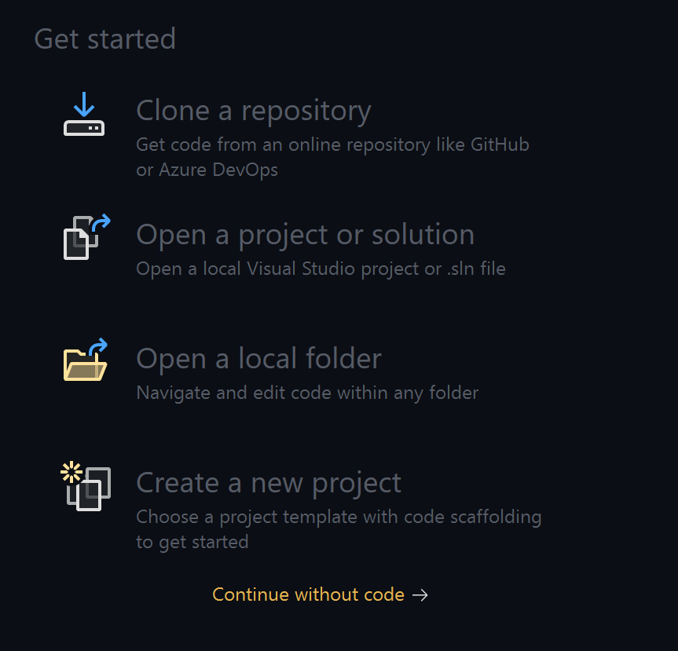
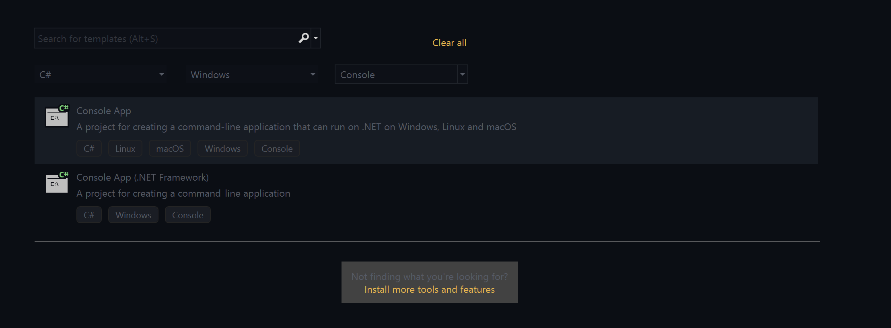
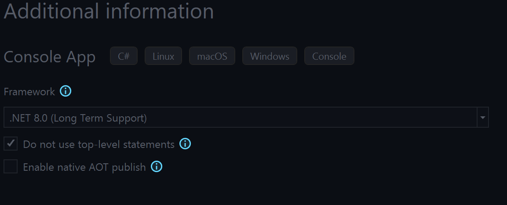
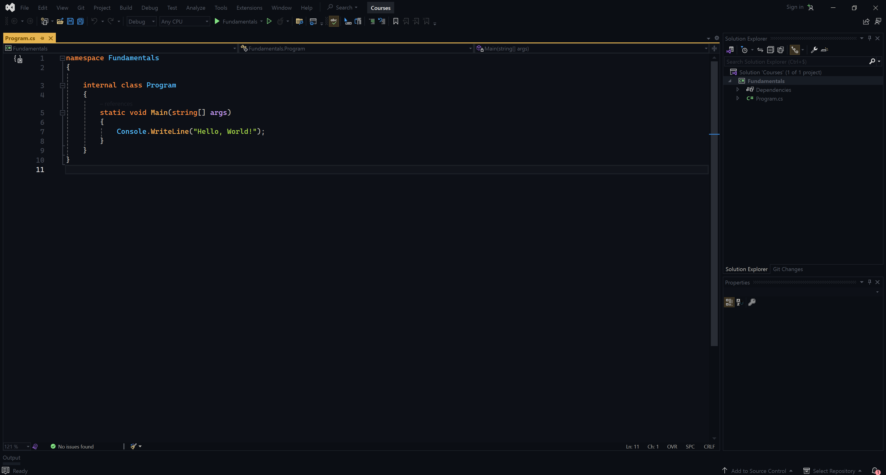
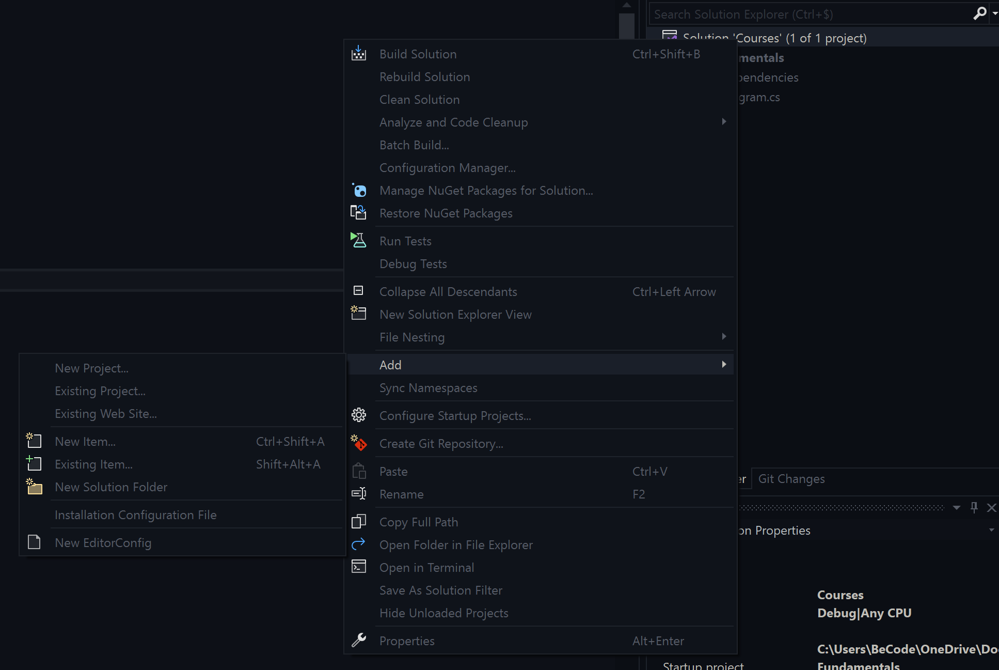
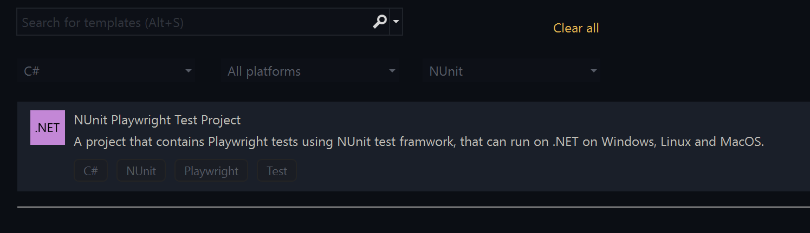
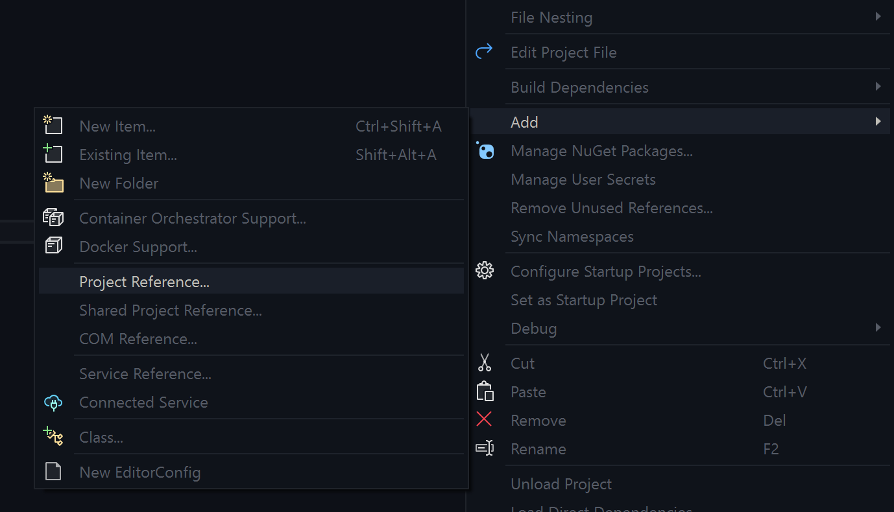

[](https://classroom.github.com/a/yiLRIMy0)
# 3.Configuration

In this section, let's create a new project in **Visual Studio** Or with **Terminal & VSCode**.

1. <a href="#1-microsoft-visual-studio">Visual Studio Code</a>
2. <a href="#2-terminal--vs-code">VScode & Terminal</a>
3. <a href="#3-unit-tests">Unit Tests Visual Studio Code</a>
3. <a href="#4-unit-tests-in-your-vscode-project">Unit Tests in your VSCode project</a>

## 1. Microsoft Visual Studio

### A. Create a new project
Open Visual Studio code and create a new project (also called `solution`).



### B. Select **Console App**



Select `Console App`

### C. Configure your new project


- **Project name:** It is the name of your project
- **Location:** Please, create a directory for this course
- **Solution name:** it is the name of the directory where all your projects will be placed

So, in this case it will be : `C:\Users\BeCode\OneDrive\Documents\Courses`

### D. Additional info



Please, check `Do not use top-level statements`

### E. You are now ready



## 2. Terminal & Vs Code

```bash
# Generate the sln file
mkdir courses
cd courses
dotnet new sln -o courses
```

> .sln file: Visual Studio solution file, organizes projects, manages dependencies, stores configurations.

```bash
# Create a new Console App
cd courses
dotnet new console -o Fundamentals

// This command adds your project in the sln file (Solution)
dotnet sln ./courses.sln add ./Fundamentals/Fundamentals.csproj
```

Open your **Program.cs** from your Fundamentals.App and update this code the given code below. If you don't understand what is written below, don't worry. We will cover OOP (Object-Oriented Programming) later.

```csharp
namespace fundamentals.App
{
    public class Program
    {
        public static void Main(string[] args)
        {
           Console.WriteLine("Hello World");
        }
    }
}
```

```csharp
# In your directory Fundamentals
dotnet run
```

## 3. Unit Tests

For all of your exercises, unit tests will be provided. They will be written for you, so you don't need to worry about that. You will find them in each chapter where exercises are presented. Now, let's see how to implement unit tests in your C# projects

### Microsoft Visual Studio

### A. Add a new project in your solution



### B. Choose Nunit



### C. Tie the projects



### D. Update your code

```csharp

// Fundamentals folder

namespace Fundamentals
{
    public class Program
    {
        static void Main(string[] args)
        {
            Console.WriteLine("Hello, World!");
        }

        public static string Hello()
        {
            return "Hello";
        }
    }
}

// TestFundamentals folder
namespace TestFundamentals
{
    public class Tests
    {
        [Test]
        public void TestHello()
        {
            Assert.That(Fundamentals.Program.Hello(), Is.EqualTo("Hello"));
        }
    }
}
```

- **Note:** To launch the tests, go to `Test > Run all tests`.

### 4. Unit Tests in your VSCode project

Go the the root of your project

```bash
cd ..
dotnet new nunit -o Testfundamentals

# Alway in your root directoryon)
dotnet sln ./courses.sln add ./TestFundamentals/Testfundamentals.csproj
```

## Last thing ...

we’ll need to tie this project to our application. First, we’ll add a reference to the application. In the console, in your fundamentals.Test folder, type in the following:

```bash
cd TestFundamentals
dotnet add reference ..\Fundamentals\Fundamentals.csproj
```

--- 

