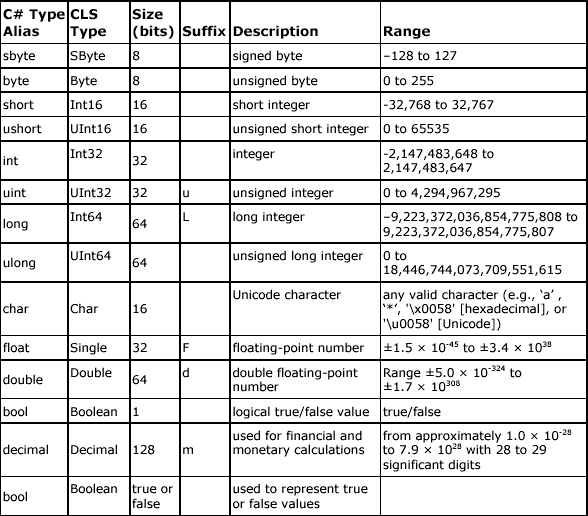
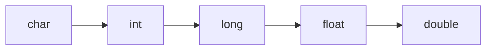
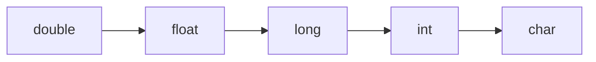

[](https://classroom.github.com/a/cU7Ompqz)
# 4. Variables

In C# variables are called data type

- **Value types** contain the actual data directly, like holding a physical object in your hand.

- **Reference types**, on the other hand, hold a reference or address to where the data is stored, like holding a map to a treasure instead of the treasure itself.

- **Pointer types** are like holding GPS coordinates, providing direct access to the exact location in memory.


In this chapter, we are going to cover:

- Value Data Type > Predefined data types which is also called variables.

## Value Data Type > Predefined data types

These types are directly provided by the C# language and are commonly used.

### Integral Numeric Types



- u : means unsigned (only positif numbers)

## Basic Variable Declaration

- **Type**: The data type of the variable (e.g., int, float, string).
- **Name**: The identifier you give to the variable.

```csharp
type variableName;

int age;         // Declares an integer variable named age
float height;    // Declares a float variable named height
```

### Initialization

You can also initialize a variable at the time of declaration.

```csharp
type variableName = initialValue;

int age = 25; // Declares and initializes an integer variable named age with a value of 25
float height = 5.9f; // Declares and initializes a float variable named height with a value of 5.9
```

## Nullable

When declaring your variable, you can assign it to null.

```csharp
int? age = null;
```

So don't forget to add the **question mark** after the type.

## Points to Remember

- Variable names should be meaningful and follow C# naming conventions (camelCase for local variables and parameters, PascalCase for public members).
- Variable types must be compatible with the values assigned to them.
- Use suffixes like

  - f for float
  - m for decimal
  - d for double
  - l for long
  - ...

When initializing these types to avoid type mismatch errors.

By following these guidelines, you can declare and initialize variables effectively in C#.

## Casting

Sometimes we need to convert one data type to another, such as converting a double to an int or a float to an int. This action is called casting and it follows certain rules. There are two types of casting: explicit casting and implicit casting.

### Inplicit

Implicit casting, also known as automatic casting, occurs when the conversion is guaranteed to be safe and no data will be lost. This is typically the case when converting from a smaller type to a larger type. The following sequence shows the typical hierarchy for implicit casting:



```csharp
// char to int
char letter = 'A';
int asciiValue = letter; // // 'A' is implicitly cast to its ASCII value 65

// int to long
int number = 100;
long bigNumber = number; // 100 is implicitly cast to a long

// long to float
long largeNumber = 100000l;
float floatingPoint = largeNumber; // 100000L is implicitly cast to a float

// float to double
float decimalNumber = 10.5f;
double largerDecimal = decimalNumber; // 10.5F is implicitly cast to a double
```

In each of these cases, the conversion is performed automatically by the compiler because there is no risk of data loss. The value from the smaller type is directly assigned to the larger type variable.

### Explicit casting

Explicit casting, also known as manual casting, is necessary when you need to convert a larger type to a smaller type. Since this conversion can result in data loss or overflow, you must explicitly specify the cast using parentheses.

The following sequence shows the typical hierarchy for explicit casting:



```csharp
// double to float
double largeDecimal = 9.99d;
float smallerDecimal = (float)largeDecimal; // Explicit cast from double to float

// float to long
float decimalNumber = 9.99f;
long integerNumber = (long)decimalNumber; // Explicit cast from float to long

// long to int
long bigNumber = 100000l;
int smallerNumber = (int)bigNumber; // Explicit cast from long to int

// int to char
int asciiValue = 65;
char letter = (char)asciiValue; // Explicit cast from int to char
```

In each of these cases, the cast operator is used to explicitly convert the value from the larger type to the smaller type.

This is necessary because there is a risk of losing data during the conversion. For example, when casting a double to a float, the precision might be reduced.

Similarly, when casting a long to an int, if the long value is too large to fit into an int, the value will be truncated or overflowed.

## Exercices

Before diving into your very first exercises, you need some explanation on how to implement them.

For each exercise, you will be given a problem and a corresponding test. Your task is to write a function that passes the test. But here is the process to follow for each point (variables, operators, loops, ...).

- In your solution, create a new project (for thoses exercices, the project will be named **Variables**). (if you are using vscode do not forget to link it into your `sln file`).

- Add this new project in your `TestFundamentals`

- Create a new `class` in your `TestFundamentals folder`

### Basic understanding of a method in C#

In order to execute correctly thoses exercices, you need some basic understanding on how to write good methods in c#. We will see OOP later in deep.


### 0. SayHello()

Write a small function to say hello to the user with his/her name. For this first exercice, I give your the solution, (of course it is an easy one).

```csharp
namespace TestVariables
{
    public class Tests
    {
        [Test]
        public void Test_Hello()
        {
            Assert.That(Variables.Solution.SayHello("John"), Is.EqualTo("Hello John"));
        }
    }
}
```

```csharp
namespace Variables
{
    public class Solution
    {
        public static string SayHello(string name)
        {
            return $"Hello {name}";
        }
    }
}
```

### 1. Age to float

Write a small function to convert a age (int) to a float and divide it by two.

```csharp
[Test]
public void Test_AgeToFloat()
{
    Assert.That(Variables.Solution.AgeToFloat(23),Is.EqualTo(11.5f));
}
```

### 2. Celcius to Farenheit

Write a small function to convert celcius to farenheit. Think about implicit parsing.

```csharp
[Test]
public void Test_CelciusToFarenheit()
{
    Assert.That(Variables.Solution.CelciusToFarenheit(2),Is.EqualTo(35.6m));
}
```

### 4. Kilometers to miles

Write a small function to transform kilometers to miles.

```csharp
[Test]
public void Test_KilometersToMiles()
{
    Assert.That(Variables.Solution.KilometersToMiles(2),Is.EqualTo(1.2));
}
```

### 5. Random a number between 1 to 10
Write a small function that return a random number between 1 to 10.

--- 

